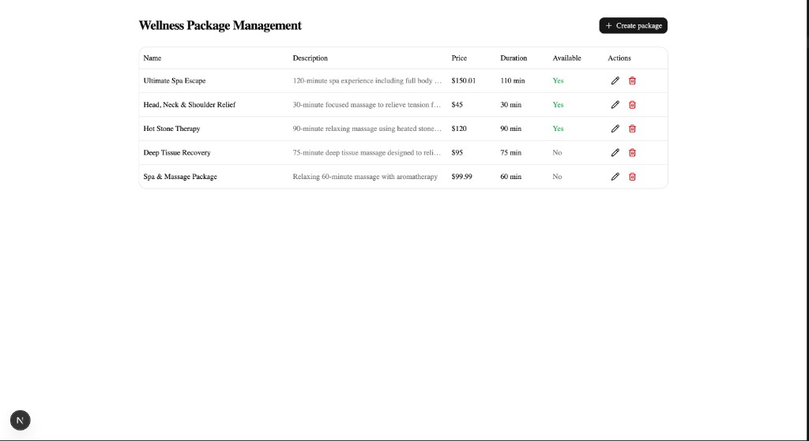
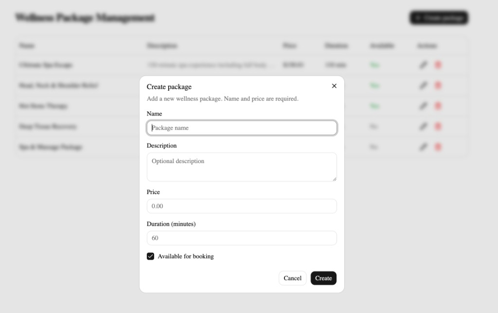
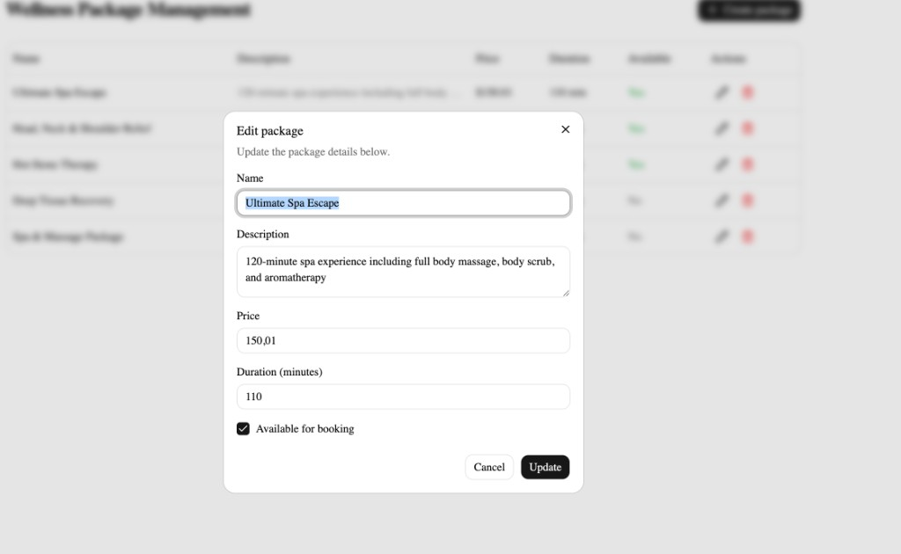
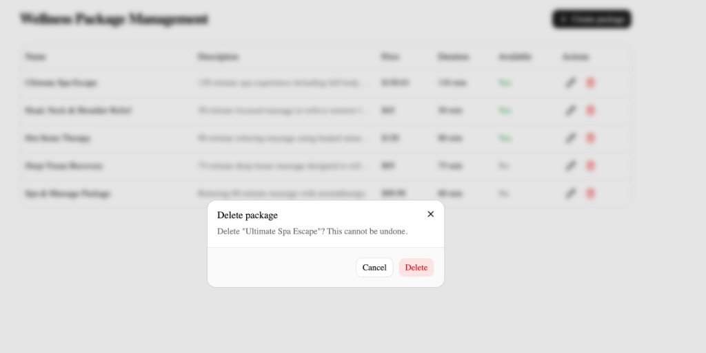
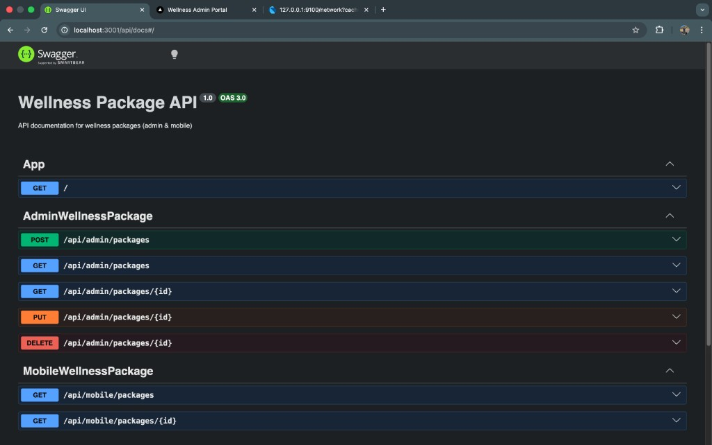
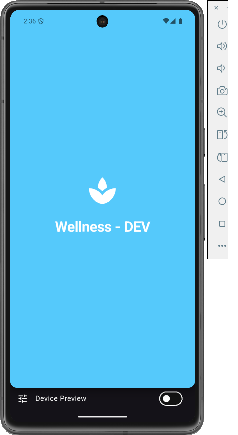
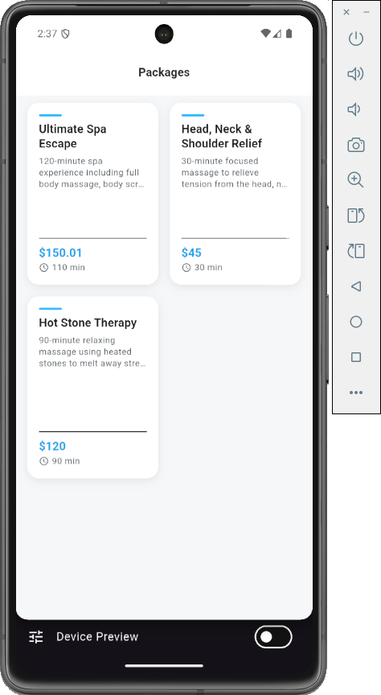
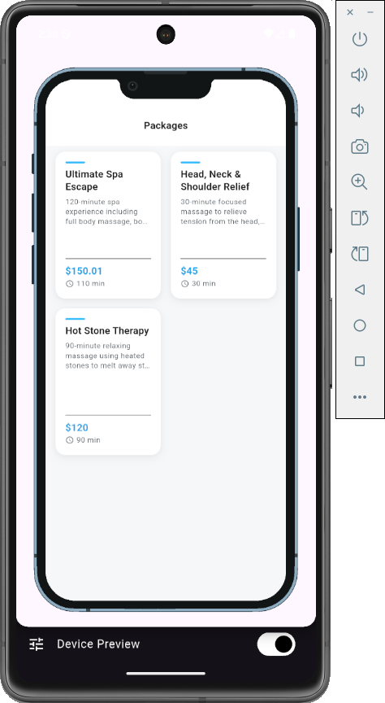
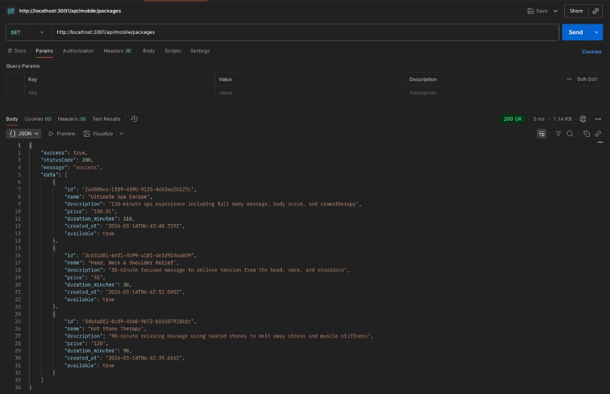

# Wellness Package System

A full-stack system for managing and browsing wellness packages: **backend API**, **admin portal** (web), and **mobile app** (Flutter).

---

## Repository structure

| Module | Description | README |
|--------|-------------|--------|
| **[backend](./backend)** | NestJS API — admin CRUD + mobile read-only endpoints, PostgreSQL (Prisma) | [Backend README](./backend/README.md) |
| **[admin-portal](./admin-portal)** | Next.js web app — create, edit, delete packages (talks to admin API) | [Admin Portal README](./admin-portal/README.md) |
| **[mobile-app](./mobile-app)** | Flutter app — browse available packages (talks to mobile API), offline cache | [Mobile App README](./mobile-app/README.md) |

Each module has its own **setup instructions**, **API design**, **architecture**, and **assumptions** — follow the links above for details.

---

## Quick start

1. **Backend:** Set `DATABASE_URL` and run migrations, then `npm run start:dev` in `backend/`.
2. **Admin portal:** Set `NEXT_PUBLIC_API_URL` (e.g. `http://localhost:3001`) and run `npm run dev` in `admin-portal/`.
3. **Mobile app:** Set `API_BASE_URL` in `environments/.env.dev` (e.g. `http://10.0.2.2:3001/api/mobile` for Android emulator), run `flutter run -t lib/main.dev.dart` in `mobile-app/`.

---

## Screenshots

Add screenshots below to illustrate the system. Recommended images:

### Admin portal

**Package management (list)**



**Create package**



**Edit package**



**Delete package**



### Backend API — Swagger documentation

API docs at `http://localhost:3001/api/docs` (Wellness Package API, admin & mobile endpoints):



### Flutter mobile app

**Splash screen**



**Packages list**





### API response example

`GET /api/mobile/packages` — sample response from the API client:



Alternatively, the response structure in code:

```json
{
  "success": true,
  "statusCode": 200,
  "message": "success",
  "data": [
    {
      "id": "...",
      "name": "Spa & Massage Package",
      "description": "Relaxing 60-minute massage",
      "price": "99.99",
      "duration_minutes": 60,
      "created_at": "2025-03-14T...",
      "available": true
    }
  ]
}
```
